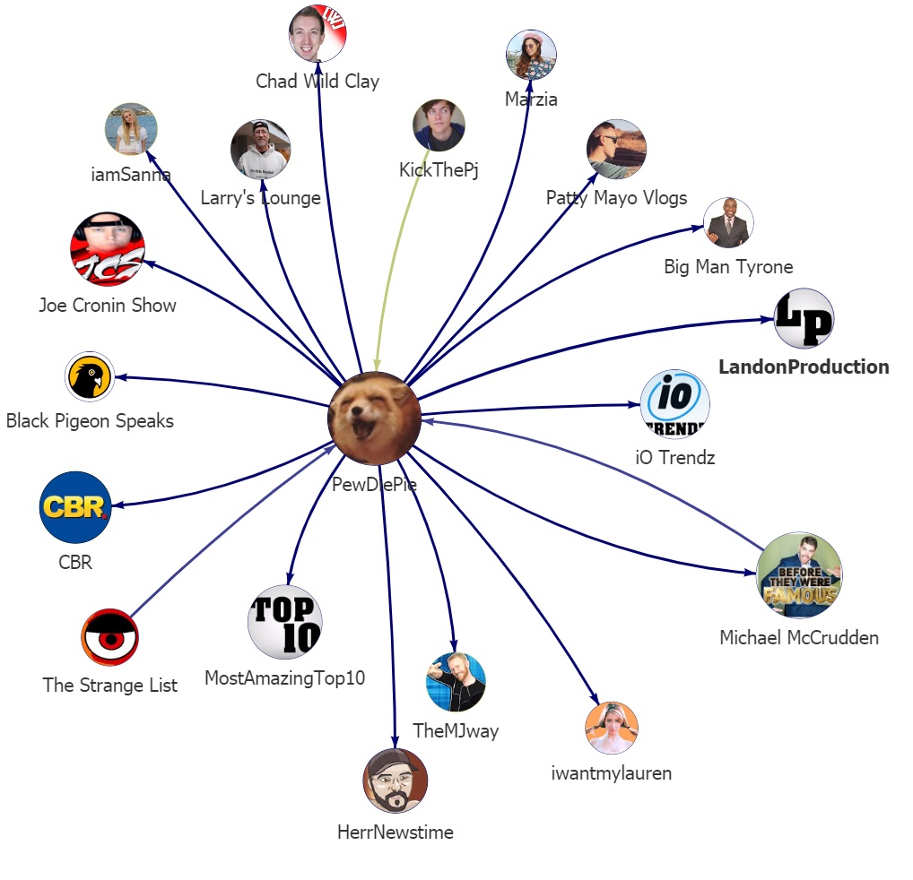

# Detection and Analysis of Content Creator Collaborations in Youtube Videos using Face Recognition

YouTube analysis concerning content creator collaborations in videos, using face recognition.
This projects includes data acquisition from YouTube, video and face processing and statistical evaluation of YouTube data.

For more information see the CATANA publication (under submission).

# Face Recognition Algorithm
For face feature extraction trained models and code from [FaceNet](https://github.com/davidsandberg/facenet) is used.
Face detection and alignment uses MTCNN [Multi-task CNN](https://kpzhang93.github.io/MTCNN_face_detection_alignment/index.html).

## Clustering
For clustering face features, the algorithm [HDBSCAN](https://github.com/scikit-learn-contrib/hdbscan) is used.

## Performance
Face recognition evaluation were conducted on the [YouTube Faces](https://www.cs.tau.ac.il/~wolf/ytfaces/) dataset aswell as Labeled Faces in the Wild [LFW](http://vis-www.cs.umass.edu/lfw/) dataset.

|     | accuracy |
|-----|----------|
| LFW | 0.993 +- 0.004   |
| YTF | 0.998 +- 0.0013  |

# Collaboration Detection

Collaborations between YouTube channel are detected based on appearing persons (faces).
Content creator are assigned to channel based on number of appearances and, as a result, collaborations are modeled in a directed graph.

Graph Schema Example:

# Data
Data for applying face recognition and evaluation can be acquired using the provided crawler in [data_collection] directory.

The dataset of this work consists of 7,942 channel, >250K videos aswell as statistical YouTube data for 3 months.

Evaluation data and plots of this dataset are made available in the data directory.
If you are interested in the actual crawled YouTube data you can contact us.

# Usage

## Installation

Depending on the use-case different requirements must be met.

For using the CATANA framework only, without evaluation of the other face recognition methods like OpenFace, see requirements.txt aswell as the
requirements of [FaceNet](https://github.com/davidsandberg/facenet).

For executing the face recognition evaluations, additionally requirements for the OpenFace (https://cmusatyalab.github.io/openface/) framework must be installed.

All use cases also require a current OpenCV 2.4 version installed.

For video extraction, youtube_dl is used, a version is included in the face_recognition directory, but should be updated to a current version when used.

## Usage

### Data Crawler

Crawling is based on Scrapy. Main crawling for YouTube is implemented in two separated jobs in the youtubeAPICrawler directory.
Crawl "populate" populates an existing MySQL database with static data of channels and should only be executes once at the beginning.
Crawl "update" is the task for repeated crawl of dynamically data like view, or subscriber counts. Its also checks for new videos uploaded by the channels in the MySQL database and 
adds these to the database. In the work of CATANA this task was executed daily.

### Face Recognition Pipeline

The face recognition pipeline is a multi-threaded script which downloads a list of YouTube videos and extracts the detected face's embeddings, which are then saved to 
the MySQL database.
File videoPipeline.py is the entry point for the face recognition pipeline, where certain videos are read from the database and a multi-thread video downloader based on youtube_dl is started.
The actual face recognition application is implemented as a convenient PostProcessor class of youtube_dl which directly plugs-in after the download process.
The process runs a long time, depending on the internet-connection and the number of videos. For us 21sec/video in average.
After video analysis is finished, the extracted face embeddings are stored in the database with information of the video and duration.
Next clustering should be executed on these embeddings.

### Collaboration Detection / Clustering

Depending on number of embeddings and your system, the clustering process can be applied through different scripts.

collabDetection.py executes all clustering steps in one job and may fall due to memory consumption.

IF COMPUTATION TIME IS TOO HIGH, USE SPLIT UP pipeline

- create features array from database
- create indices splitting the matrix up into n parts using collabCreateIndex.py
- compute the parts separate using collabCompIndexBlock.py or collabCompIndexBlockProcess.py

IF MEMORY CONSUMPTION IS TOO HIGH

- try mem-mapped script types, loading the distance matrices as mem-mapped numpy arrays

After clustering, cluster are stored in the database and using the 00_Collaboration.ipynb notebook the collaboration detection and graph creation can be executed.

### Visualization

Directory src/visualization contains different scripts to the creation of a interactive visualization of the found collaboration in form of a graph.

CATANA collaboration graph overview:

1-hop sub-graph for the "PewDiePie" channel:

For further information see the respective directory README files and code documentation for instructions.

## Evaluation

Data evaluation is based on Jupyter notebook .ipynb files located in data_evaluation.
File names indicate a execution order, while 'XX' files can be executed independent after the strict order execution.

- 00_Channel Statistics.ipynb: Evaluates channel statistics, mainly only statically data and no daily statistics.
- 01_Collaborations.ipynb: Reads the found cluster from the database, creates the actual collaboration graph.
- 02_Collaborations_Graph_Metric.ipynb: Graph metrics evaluation, clustering cooefficient etc.
- Collaboration History Channel/Video Statistics.ipynb: Both files evaluate the effects on video or channel statistics (ie. view, subscriber counts)

# Directories

## data
contains evaluation results and plots

## src
contains code for the different pipeline steps

### data_collection
crawler code for YouTube, Socialblade and Google Images

### data_evaluation
evaluation code, jupyter-notebook based evaluation, code for plot creation

### face_recognition
video download, face recognition and clustering pipeline, contains Facenet code base aswell as youtube_dl

### visualization
collaboration graph visualization based on Gugel Universum (http://universum.gugelproductions.de/).

### external
misc scripts, face recognition evaluation scripts (heavily based on FaceNet and OpenFace (https://cmusatyalab.github.io/openface/) code)
